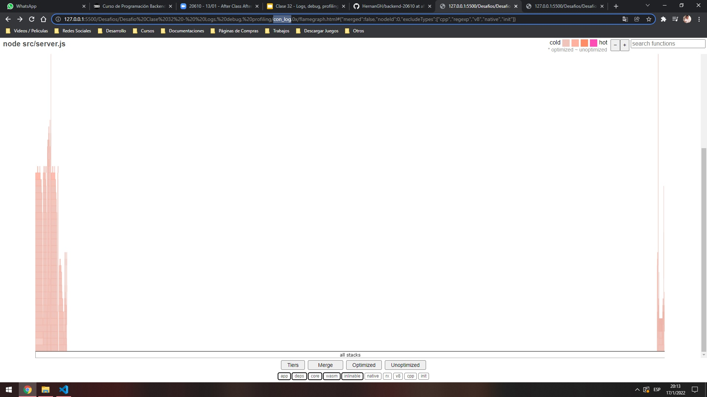
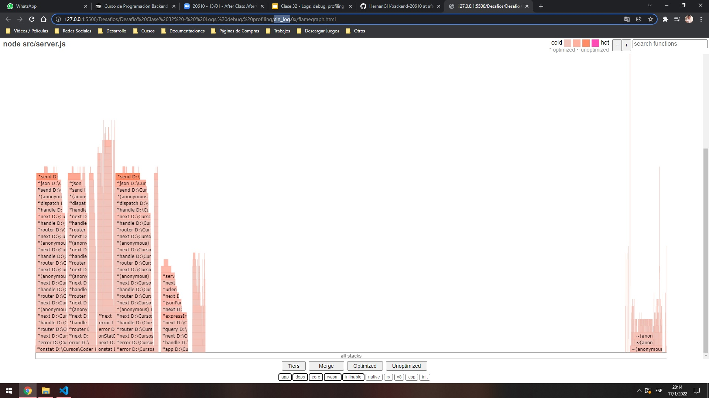

# Report

## Artillery
### Result of profiling with node without console.log
```
 [Summary]:
   ticks  total  nonlib   name
      8    0.0%  100.0%  JavaScript
      0    0.0%    0.0%  C++
     15    0.0%  187.5%  GC
  51420  100.0%          Shared libraries
```

### Result of profiling with node with console.log
```
 [Summary]:
   ticks  total  nonlib   name
      7    0.1%   87.5%  JavaScript
      0    0.0%    0.0%  C++
     11    0.2%  137.5%  GC
   6925   99.9%          Shared libraries
      1    0.0%          Unaccounted
```

## Autocannon
### With console.log
```
Running all benchmarks in parallel ...
Running 20s test @ http://localhost:8081/info
100 connections

┌─────────┬───────┬───────┬───────┬───────┬──────────┬─────────┬────────┐      
│ Stat    │ 2.5%  │ 50%   │ 97.5% │ 99%   │ Avg      │ Stdev   │ Max    │      
├─────────┼───────┼───────┼───────┼───────┼──────────┼─────────┼────────┤      
│ Latency │ 33 ms │ 36 ms │ 61 ms │ 71 ms │ 38.24 ms │ 8.32 ms │ 141 ms │      
└─────────┴───────┴───────┴───────┴───────┴──────────┴─────────┴────────┘      
┌───────────┬─────────┬─────────┬─────────┬─────────┬──────┬────────┬─────────┐
│ Stat      │ 1%      │ 2.5%    │ 50%     │ 97.5%   │ Avg  │ Stdev  │ Min     │
├───────────┼─────────┼─────────┼─────────┼─────────┼──────┼────────┼─────────┤
│ Req/Sec   │ 1497    │ 1497    │ 2669    │ 2905    │ 2584 │ 352.59 │ 1497    │
├───────────┼─────────┼─────────┼─────────┼─────────┼──────┼────────┼─────────┤
│ Bytes/Sec │ 1.16 MB │ 1.16 MB │ 2.07 MB │ 2.25 MB │ 2 MB │ 274 kB │ 1.16 MB │
└───────────┴─────────┴─────────┴─────────┴─────────┴──────┴────────┴─────────┘

Req/Bytes counts sampled once per second.

52k requests in 20.09s, 40 MB read
```

### Without console.log
```
Running all benchmarks in parallel ...
Running 20s test @ http://localhost:8081/info
100 connections

┌─────────┬───────┬───────┬───────┬───────┬──────────┬─────────┬────────┐
│ Stat    │ 2.5%  │ 50%   │ 97.5% │ 99%   │ Avg      │ Stdev   │ Max    │
├─────────┼───────┼───────┼───────┼───────┼──────────┼─────────┼────────┤
│ Latency │ 32 ms │ 36 ms │ 59 ms │ 66 ms │ 37.43 ms │ 7.44 ms │ 135 ms │
└─────────┴───────┴───────┴───────┴───────┴──────────┴─────────┴────────┘
┌───────────┬─────────┬─────────┬─────────┬─────────┬─────────┬────────┬─────────┐
│ Stat      │ 1%      │ 2.5%    │ 50%     │ 97.5%   │ Avg     │ Stdev  │ Min     │
├───────────┼─────────┼─────────┼─────────┼─────────┼─────────┼────────┼─────────┤
│ Req/Sec   │ 1569    │ 1569    │ 2701    │ 2905    │ 2641.65 │ 312.23 │ 1569    │
├───────────┼─────────┼─────────┼─────────┼─────────┼─────────┼────────┼─────────┤
│ Bytes/Sec │ 1.21 MB │ 1.21 MB │ 2.09 MB │ 2.25 MB │ 2.05 MB │ 243 kB │ 1.21 MB │
└───────────┴─────────┴─────────┴─────────┴─────────┴─────────┴────────┴─────────┘

Req/Bytes counts sampled once per second.

53k requests in 20.11s, 40.9 MB read
```

## Flame Graphs
### With console.log


### Without console.log



## Conclusion
`Con un simple console.log, ya se nota la diferencia entre los procesos y gráficos.`